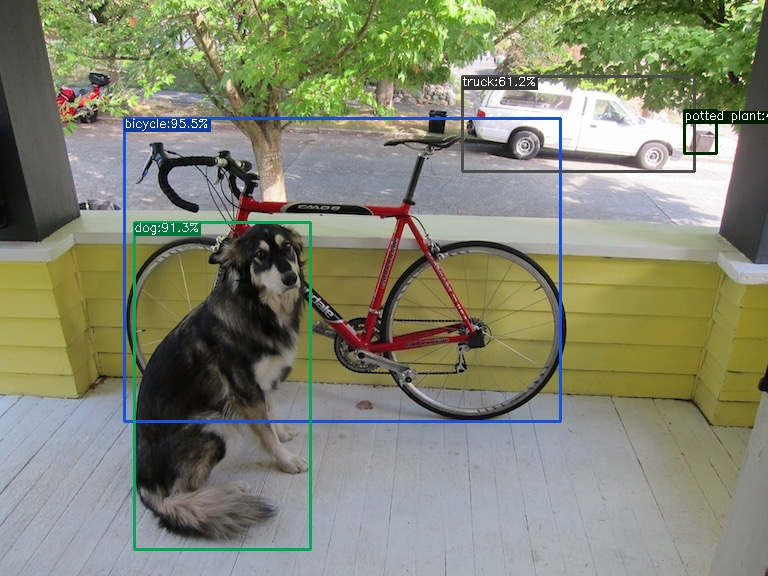

## YOLOX使用说明

### 什么是[YOLOX](https://github.com/Megvii-BaseDetection/YOLOX)？


​	YOLOX是旷视科技基于YOLO系列改进而成的高性能目标检测器，结合了近两年出现的anchor-free，标签分配，数据增广等技术，向较于YOLOv3, YOLOv4, YOLOv5等拥有更高的性能，可以有效地弥合目标检测领域内技术研究与产业应用之间的差距

### 快速使用

**1.安装YOLOX**

```
git clone git@github.com:Megvii-BaseDetection/YOLOX.git
cd YOLOX
pip3 install -U pip && pip3 install -r requirements.txt
pip3 install -v -e .  # or  python3 setup.py develop
```

**2.安装[pycocotools](https://github.com/cocodataset/cocoapi)（可选）**

```
pip3 install cython; pip3 install 'git+https://github.com/cocodataset/cocoapi.git#subdirectory=PythonAPI'
```

**3.验证安装环境**

下载官方提供的训练好的权重模型yolox_s.pth，运行以下指令

```
cd YOLOX
python tools/demo.py image -n yolox-s -c /path/to/your/yolox_s.pth --path assets/dog.jpg --conf 0.25 --nms 0.45 --tsize 640 --save_result --device [cpu/gpu]
```

```
python tools/demo.py image -f exps/example/custom/yolox_s.py -c yolox_s.pth --path assets/dog.jpg --conf 0.25 --nms 0.45 --tsize 640 --save_result --device [cpu/gpu]
```

所保存图像如下所示则说明环境配置成功



### 数据集训练（COCO）

YOLOX的数据集训练有COCO和VOC两种方式，以下将简要概述使用COCO数据集训练的方法：

**1.标注：**使用[labelImg](https://github.com/tzutalin/labelImg) 对数据集进行标注

**2.数据集结构转换**：参考[YOLO2COCO](https://github.com/RapidAI/YOLO2COCO)等项目将数据集结构转换为如下格式：

```
VOC
├── annotations
├── train2017
    ├── 0000001.jpg
    ├── ...
├── val2017
    ├── 0000001.jpg
    ├── ...
```

**3.数据集转移：**将数据集`VOC`转移至`$YOLOX_DIR/datasets`

**4.修改数据集保存路径与类别个数:**在文件路径`YOLOX_DIR/exps/example/custom/yolox_s.py`中，将`self.data_dir`修改为自己数据集的保存路径，将`self.num_classes`修改为自己数据集所要识别的类别个数


**5.修改数据集名称：**在文件路径` YOLOX_DIR/yolox/data/datasets/coco_classes.py`处将`COCO_CLASSES`修改为自己数据集所要识别的类别名称	


**6.训练数据集**

在`/YOLOX_DIR`下执行以下命令：

```
python3 tools/train.py -f exps/example/custom/yolox_s.py -d 1 -b 64 --fp16  -c yolox_s.pth
```

训练所得结果保存在`YOLOX_DIR/YOLOX_outputs/yolox_s`中

### 训练模型转换

模型训练完成后需要将`.pth`文件转换为OpenVINO所需要的`.xml`与`.bin`文件，转化流程如下所示：

```
  .pth-> .onnx  # 通过执行文件 /tools/export_onnx.py
            └─> .onnx -> .xml/.bin  #通过执行文件：/opt/intel/openvino_DIR/deployment_tools/model_optimizer/mo_onnx.py
```

**1.pth2onnx**

```
python3 tools/export_onnx.py --output-name best01.onnx -f exps/example/custom/yolox_s.py -c best01.pth
```

**2.onnx2xml**

```
python3 /opt/intel/openvino_2021/deployment_tools/model_optimizer/mo_onnx.py --input_model best01.onnx --input_shape [1,3,640,640] --data_type FP16 --output_dir converted_output
```

### 验证模型

`YOLOX_DIR/demo/OpenVINO`中有c++和python两套使用OpenVINO部署YOLOX的代码，执行相应指令验证训练结果(以python为例)

```
cd ~/YOLOX/demo/OpenVINO/python
python3 openvino_inference.py -m best00.xml -i cola.jpg
```

